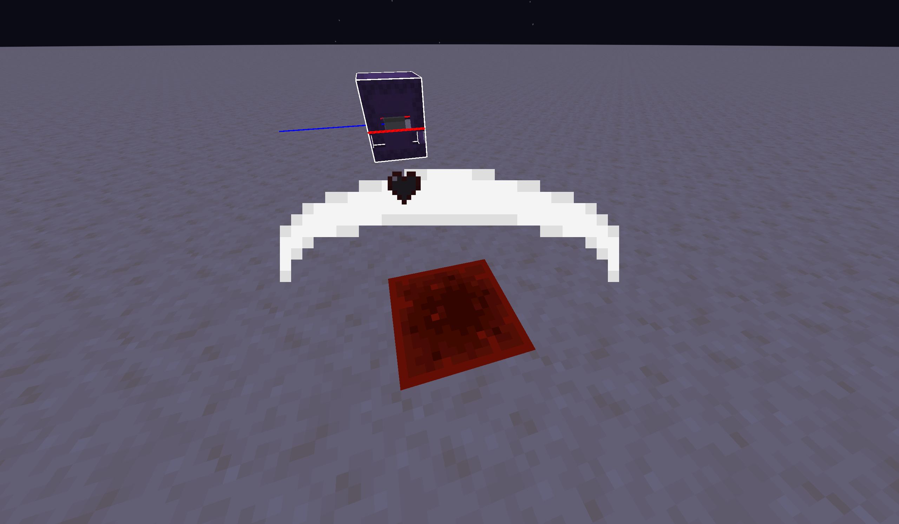

# quartz
Make Solid Entities Transparent

PS: this is my first shader project so be nice and don't complain it's so simple

## how it works:

This pack allows for making solid entities, like the shulker head transparent by giving them a specific color: #010203 or rgb(1,2,3)

