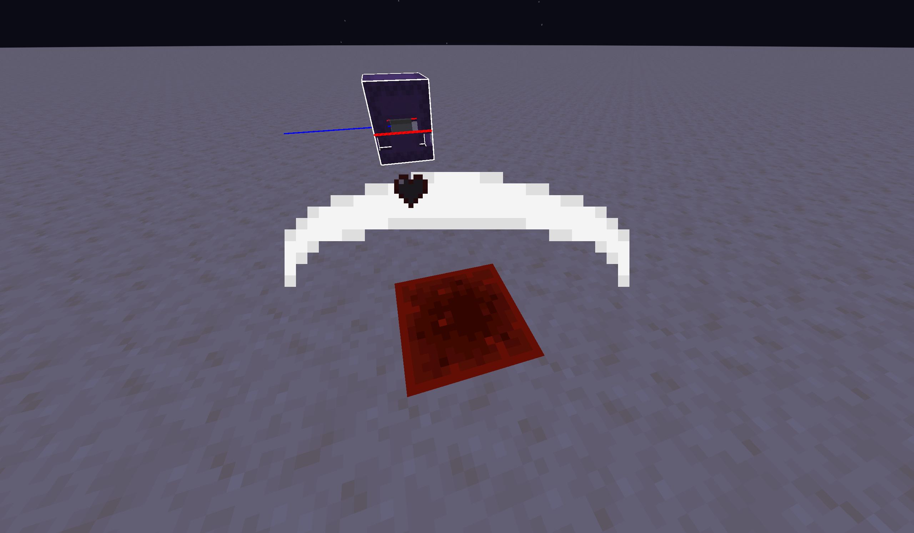

Make Solid Entities Transparent

PS: this is my first shader project so be nice and don't complain it's so simple

## how it works:

This pack allows for making solid entities, like the shulker head transparent by giving them a specific color: #010203 or rgb(1,2,3)

Here is a list of the entities which it can be used on:
- The base (not flag) of banners,
- Shulker heads,
- Books on lecterns/enchantment tables,
- Shields,
- Beds,
- The bell part of bells,
- Capes,
- Shells of conduits,
- Paintings,
- Tridents,
- The ears on the Deadmau5 skin,
- The bottom skin layer of the first-person hand,
- The conduit item in the inventory.

